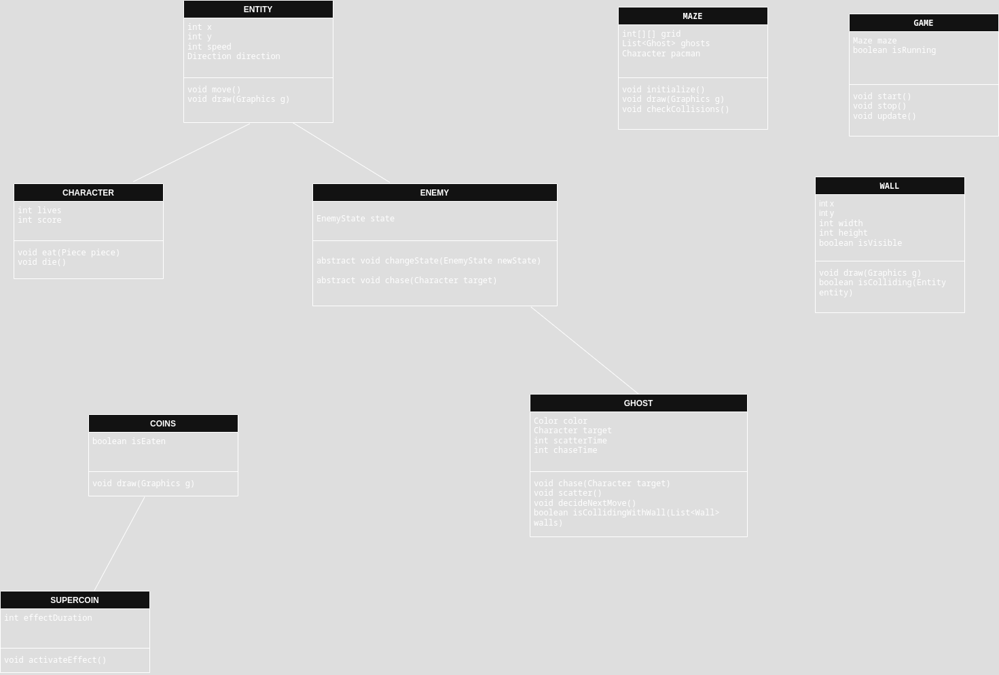

#  Pac-Man Clone (Java Swing)

A modern recreation of the classic **Pac-Man** game written in **Java** using **Swing** for the GUI. This version features animated player movement, multiple ghost behaviors, collectible coins and super coins, and a complete game loop with win/loss states.

---

##  Features

- Classic Pac-Man gameplay:
  - Keyboard movement
  - Animated mouth and eye
  - 4 ghosts with AI states: `CHASE`, `SCATTER`, `FRIGHTENED`
  - Super coins that make ghosts vulnerable
- Coins, score, lives, and game over logic
- Maze rendering with walls and collectibles
- Game states: menu, playing, victory, game over

---

##  Class Diagram



---

##  Requirements

- Java 17 or later
- IDE (like IntelliJ / Eclipse) **or** command line setup with `javac` / `java`

---

##  How to Run

###  Compile & Run from Terminal

```bash
cd src
javac main/java/fr/ynov/pacman/**/*.java
java main.java.fr.ynov.pacman.main.Main
